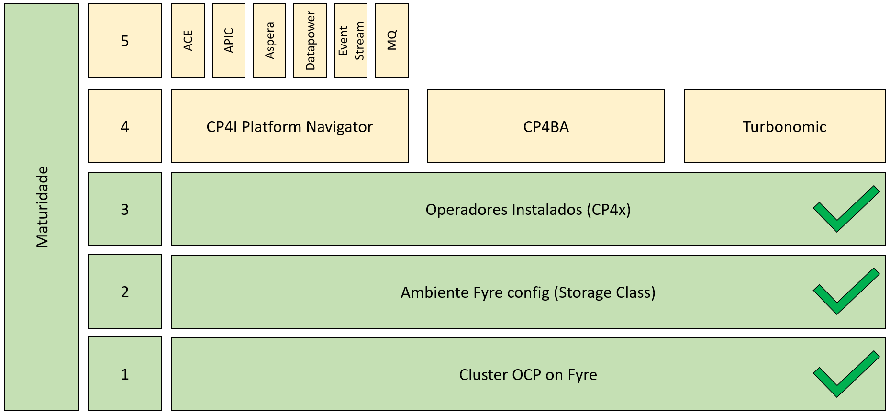
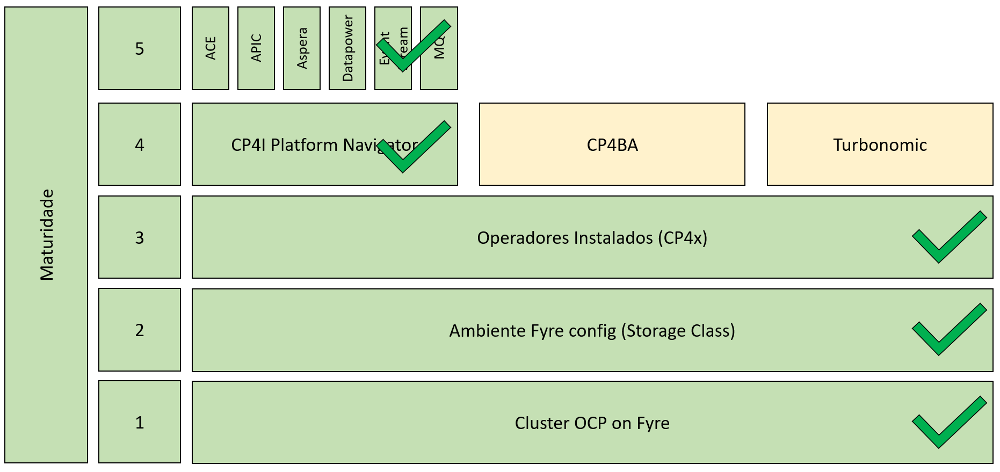

# Instalando o Operador do CP4I no cluster Openshift / Installing CP4I operator on Openshift cluster

This git is part of  instructions available on https://w3.ibm.com/w3publisher/preparing-fyre-for-cloud-pak-cp4x/cp4x

### 1. [Instalando os operadores do CP4x](https://github.com/alexandrezanetti/cp4x/blob/main/README.md) 

### 2. [Criando uma instância do CP4I-Platform Navigator](platformNavigatorInstance/README.md) 

# 3. Criando uma instância do CP4I-APIC 
### 3.1 [Criando uma instância do CP4I-APIC ](apiconnectInstance/README.md) 
### 3.2 [Criando uma instância do CP4I-Aspera](asperaHstsInstance/README.md) 
### 3.3 [Criando uma instância do CP4I-Datapower](https://w3.ibm.com/w3publisher/data-power) 

